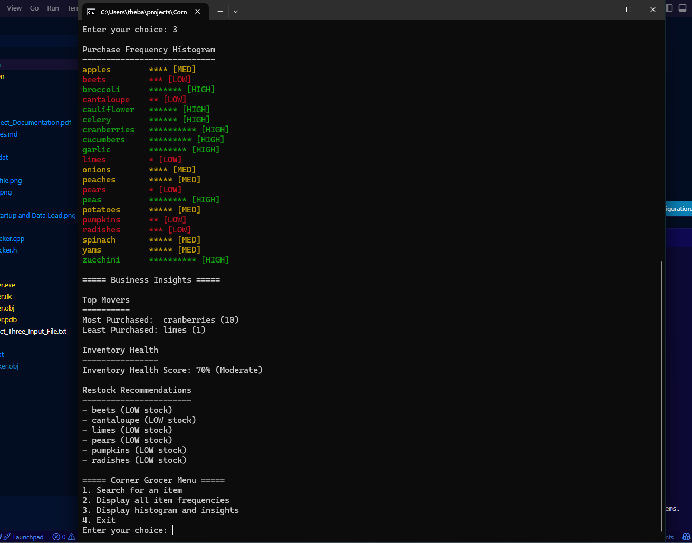

# Corner Grocer Item Frequency Tracker

A C++ data analysis application that transforms grocery transaction data into frequency summaries and inventory insights.


---

## Project Overview

The Corner Grocer Item Frequency Tracker analyzes daily grocery transaction records and transforms raw purchase data into structured frequency summaries and inventory insights.

The program allows users to:

- Look up how often a specific item was purchased  
- View all item frequencies  
- Display a text-based histogram  
- Review inventory health and restock recommendations  
- Automatically generate a backup data file  

This project demonstrates foundational and intermediate C++ concepts, including object-oriented design, file I/O, standard library containers, and defensive programming.

---

## Use Case

Retail teams can use this tool to quickly identify high-demand and low-demand products, supporting decisions around inventory planning, shelf allocation, and restocking priorities.

---

## Key Capabilities

- Modular C++ application using STL containers to analyze transactional data
- Automated data backup and case-insensitive item lookup
- Business-focused insights such as inventory health and restock recommendations

---

## Table of Contents

- [Project Overview](#project-overview)
- [Key Capabilities](#key-capabilities)
- [Technologies Used](#technologies-used)
- [Program Design](#program-design)
- [How the Program Works](#how-the-program-works)
- [Features](#features)
- [File Breakdown](#file-breakdown)
- [How to Run](#how-to-run)
- [Example Output](#example-output)
- [Screenshots](#screenshots)
- [Engineering Takeaways](#engineering-takeaways)
- [License](#license)
- [Contact](#contact)

---

## Technologies Used

- **Language:** C++17  
- **Concepts:**  
  - Object-Oriented Programming  
  - File I/O  
  - STL `std::map`  
  - Input validation  
  - Data normalization (case-insensitive lookup)  
- **Tools:**  
  - Visual Studio / VS Code  
  - MSVC Compiler (`cl.exe`)  

---

## Program Design

The application is structured around a dedicated `GroceryTracker` class that encapsulates all data-processing and analytics logic, while `main.cpp` manages user interaction and control flow.

### Key Design Decisions

- `std::map<std::string, int>` is used for frequency tracking to ensure unique keys and deterministic, alphabetical output  
- Item names are normalized to lowercase to support user-friendly, case-insensitive searches  
- Clear separation of concerns between:
  - Data processing and analytics (`GroceryTracker`)
  - User interaction and control flow (`main.cpp`)

This design improves readability, maintainability, and extensibility.

---

## How the Program Works

1. Transaction data is read from an external input file at program startup  
2. Item names are normalized to support case-insensitive lookups  
3. Frequencies are stored using an STL `std::map`  
4. Users interact with the program through a menu-driven interface  
5. Reports and histograms are generated on demand  
6. A backup data file (`frequency.dat`) is automatically created  

> **Note:**  
> The input data file is stored in a dedicated `data` directory, and the program’s working directory is configured accordingly during execution to allow relative file access without hardcoding paths.

---

## Features

### Menu Options

1. Look up the frequency of a specific item  
2. Display all item frequencies  
3. Display a histogram and business insights  
4. Exit the program  

### Business & Usability Enhancements

- Inventory health scoring based on demand levels  
- Identification of most- and least-purchased items  
- Restock and shelf-space recommendations  
- Automatic generation of `frequency.dat` as a backup file  
- Input validation to prevent invalid menu selections  

---

## File Breakdown

| File | Purpose |
|------|---------|
| `src/main.cpp` | Program entry point and menu logic |
| `src/GroceryTracker.h` | `GroceryTracker` class definition |
| `src/GroceryTracker.cpp` | `GroceryTracker` class implementation |
| `data/CS210_Project_Three_Input_File.txt` | Input transaction data |
| `output/frequency.dat` | Generated output file containing item frequencies |

---

## How to Run

### Compile (MSVC)

```bash
cl src/main.cpp src/GroceryTracker.cpp /Fe:CornerGrocer.exe
```

### Run

```bash
CornerGrocer.exe
```

> **Note:** The input data file is stored in a dedicated `data` directory, and the program’s working directory is configured accordingly during execution to allow relative file access without hardcoding paths.

---

## Example Output

```text
===== Purchase Frequency Histogram =====
apples ******** [HIGH]
cranberries ********** [HIGH]
limes * [LOW]

===== Inventory Health =====
Inventory Health Score: 70% (Moderate)

===== Restock Recommendations =====
- limes (LOW stock)
```

*Note: Item lookup is case-insensitive for improved user experience.*

---

## Screenshots

**Program Startup and Data Load**  


**Histogram and Business Insights Output**  


---

## Engineering Takeaways

This project demonstrates practical experience in:

- Designing modular C++ applications with clear class responsibilities
- Safely handling file input/output and runtime errors
- Leveraging STL containers for efficient data processing
- Normalizing and validating user input for reliability
- Translating raw transactional data into actionable operational insights

---

## License

This project is released under the MIT License and is available for review, reuse, and adaptation.

---

## Contact

**Erica Kinch**  
Computer Science | Data & Software Development

🔗 **GitHub:** [github.com/ekdoestech](https://github.com/ekdoestech)  
🔗 **LinkedIn:** [linkedin.com/in/erica-kinch](https://www.linkedin.com/in/erica-kinch/)  
📧 **Email:** [ek.does.tech@gmail.com](mailto:ek.does.tech@gmail.com)
